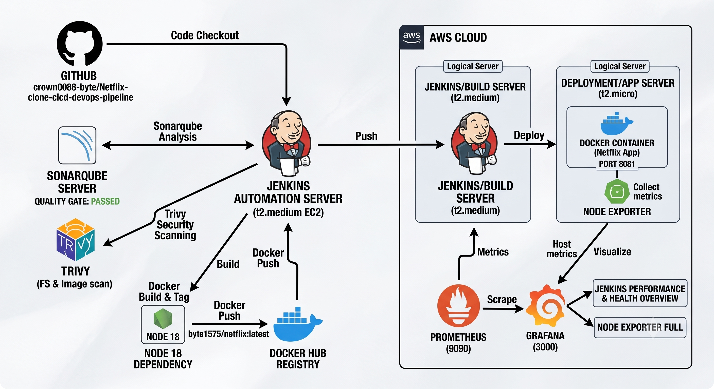
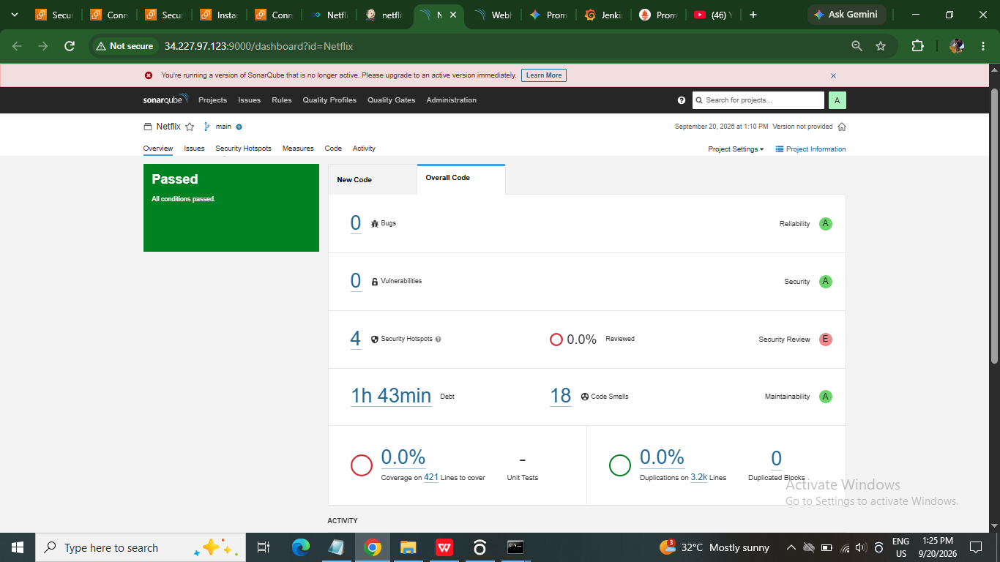
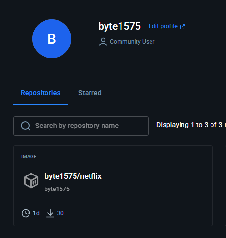
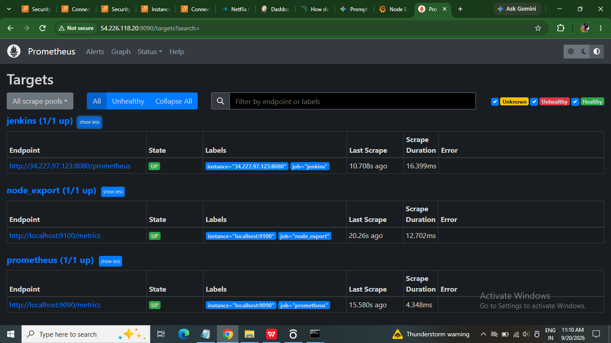
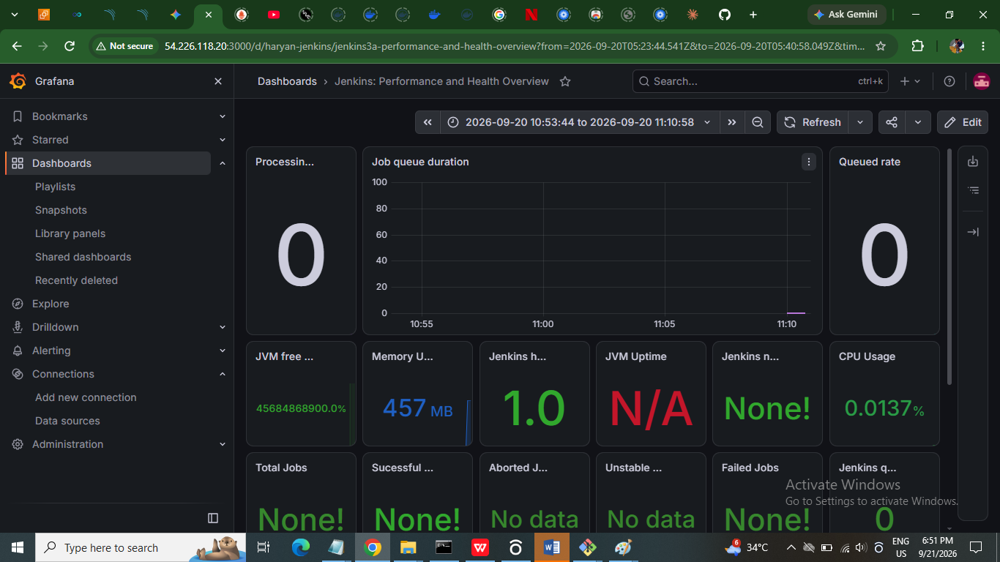
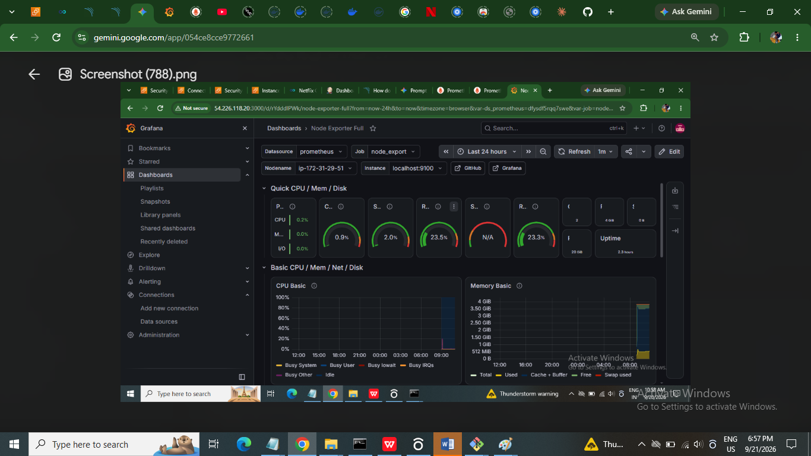

# DevSecOps CI/CD Pipeline: Netflix Clone

## Project Overview
Engineered a comprehensive CI/CD pipeline on AWS EC2 to automate the deployment of a containerized web application. Integrated continuous testing, static code analysis, and infrastructure monitoring to ensure a secure and reliable deployment lifecycle.

## Architecture Diagram

## Technology Stack
* **Cloud Infrastructure:** AWS EC2 (Ubuntu)
* **CI/CD Automation:** Jenkins, Git
* **Code Quality & Security:** SonarQube, Trivy (Filesystem & Image scanning)
* **Containerization:** Docker, Docker Hub
* **Monitoring:** Prometheus, Grafana

## Pipeline Stages
1. **Source Code Checkout:** Pulled the latest application code from GitHub.
2. **Static Code Analysis:** Executed SonarQube to scan for bugs, vulnerabilities, and code smells, enforcing a strict Quality Gate.
3. **Security Scanning:** Utilized Trivy for comprehensive filesystem and Docker image vulnerability scanning.
4. **Build & Package:** Built a customized Docker image and pushed the tagged artifact to Docker Hub.
5. **Deployment:** Deployed the containerized Netflix application on an AWS EC2 instance.
6. **Continuous Monitoring:** Configured Prometheus and Grafana to track Jenkins pipeline performance and underlying host system metrics.

## Technical Challenges & Resolutions
* **Node.js Dependency Mismatch:** The source Dockerfile required Node 16, causing application build failures due to downstream dependencies requiring Node 18. Resolved this by dynamically injecting a `sed` command into the Jenkins declarative pipeline to upgrade the base image to `node:18-alpine` prior to the build stage.
* **Network Traffic Routing:** The final container deployment timed out in the browser. Diagnosed AWS EC2 networking constraints and resolved the issue by explicitly reconfiguring the VPC Security Group inbound rules to allow custom TCP traffic on port 8081.

## Visual Documentation

### Jenkins Pipeline Execution

### SonarQube Quality Gate

### Docker Hub Registry

### Live Application Deployment

### Prometheus Targets

### Grafana Jenkins Dashboard

### Grafana System Metrics
